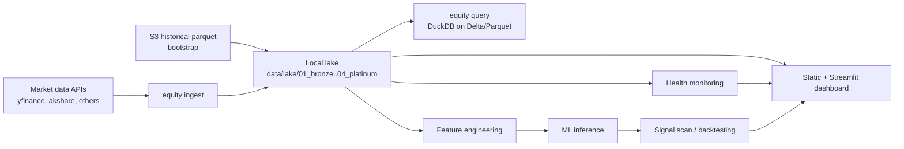

# equity-lake

Local-first equity data pipeline for bootstrapping historical data, appending daily market updates, generating features and ML outputs, and querying the lake with DuckDB.

## What It Does

- Bootstraps historical data from S3 into a local Parquet lake
- Appends daily EOD data across supported equity markets
- Runs a three-stage pipeline: ingestion, features, and ML
- Exposes local analysis, monitoring, signals, backtesting, and dashboard workflows through one `equity` CLI

## Pipeline



## Quick Start

### Prerequisites

- Python 3.12 or 3.13
- [`uv`](https://github.com/astral-sh/uv)
- [`dotenvx`](https://dotenvx.com/) for commands that rely on `.env`
- AWS CLI or `s5cmd` if you want to bootstrap from S3

### Install

```bash
uv sync
cp .env.example .env
```

Core defaults live in `config/settings.yaml`. Environment overrides use the `EQUITY_` prefix.

### Verify The CLI

```bash
uv run equity --help
uv run equity ingest --help
uv run equity pipeline --help
```

### Common Workflows

Bootstrap from S3:

```bash
dotenvx run -- uv run equity sync --bucket s3://your-bucket/us_equity
```

Run daily ingestion:

```bash
dotenvx run -- uv run equity ingest
dotenvx run -- uv run equity ingest --markets us,cn --date 2026-06-06
```

Run the full pipeline:

```bash
dotenvx run -- uv run equity pipeline
dotenvx run -- uv run equity pipeline --dry-run --verbose
dotenvx run -- uv run equity pipeline --markets us --tickers AAPL,MSFT,NVDA
```

Inspect data quality and query results:

```bash
dotenvx run -- uv run equity monitor --output-json site/health-report.json
dotenvx run -- uv run equity query --query latest_summary
```

Build or serve the dashboard:

```bash
dotenvx run -- uv run equity dashboard build --output-dir site
dotenvx run -- uv run equity dashboard serve --port 8501
```

## Canonical CLI

The supported interface is the unified Typer app:

```bash
uv run equity --help
```

Key commands:

- `equity ingest`
- `equity pipeline`
- `equity query`
- `equity monitor`
- `equity signal scan`
- `equity backtest`
- `equity dashboard build`
- `equity dashboard serve`
- `equity config`
- `equity loader`
- `equity update`

## Data Layout

The local lake uses Hive-style partitions:

```text
data/lake/
├── us_equity/date=YYYY-MM-DD/*.parquet
├── cn_ashare/date=YYYY-MM-DD/*.parquet
├── hk_sg_equity/date=YYYY-MM-DD/*.parquet
├── jpx_equity/date=YYYY-MM-DD/*.parquet
├── krx_equity/date=YYYY-MM-DD/*.parquet
└── features/
```

DuckDB queries run directly on these Parquet files.

## Docs Map

- [Getting Started](docs/getting-started/quickstart.md): first install and first run
- [Pipeline Guide](docs/user-guide/pipeline.md): pipeline stages, config, monitoring, scheduling
- [CLI Reference](docs/user-guide/20260406-cli-reference.md): config, loader, update, and dashboard commands
- [Signals Guide](docs/user-guide/signals.md): watchlists and signal outputs
- [Backtesting Guide](docs/user-guide/backtesting.md): strategy workflows
- [Dashboard Hosting](docs/user-guide/20260406-dashboard-hosting.md): static site build and Pages flow
- [API Keys And Credentials](docs/20260406-api-keys.md): optional integrations and secret setup
- [Architecture](docs/developer/architecture/ARCHITECTURE.md): system design and module boundaries
- [Project Structure](docs/developer-guide/project-structure.md): package layout and contributor orientation
- [Documentation Index](docs/README.md): entry point for the full docs tree

## Project Structure

```text
src/equity_lake/
├── cli/          Unified Typer CLI
├── ingestion/    Market ingestion orchestration
├── storage/      DuckDB, parquet, Delta, S3 sync
├── features/     Feature engineering
├── ml/           Forecasting and model workflows
├── signals/      Signal generation and formatting
├── backtesting/  Strategy execution and analysis
├── dashboard/    Static export and Streamlit app
└── core/         Runtime, paths, logging, config
```

## Notes

- The CLI is local-first after bootstrap; it does not require a long-running cloud service.
- China ingestion currently defaults to the shipped `akshare` path.
- Static hosting is generated from local artifacts; GitHub Pages is the documented deployment target.

## License

MIT License.
