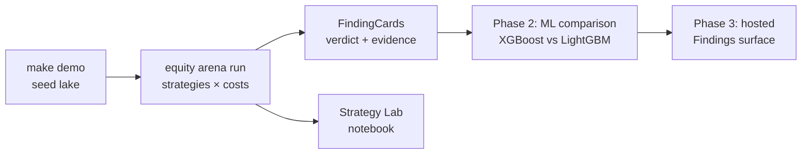
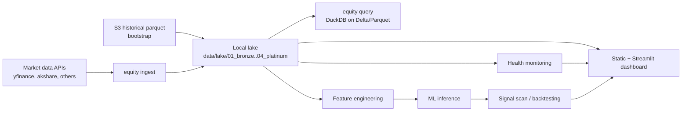

# equity-lake

> **An evidence-backed quantitative equity research platform.** A local-first data
> lake feeds a strategy arena and (Phase 2) an ML model-comparison harness; every
> result is a machine-readable **FindingCard** carrying a verdict — *including
> honest negatives.* Built as a Data Scientist / Quant / AI Engineer portfolio.

🔗 **Live demo (coming)** — for now, walk the [Strategy Lab notebook](notebooks/11-strategy-lab.ipynb).

### The showcase path (60 seconds)

```bash
make demo            # seed the lake — synthetic & offline-safe (`equity demo seed --real` for market data)
dotenvx run -- uv run equity arena run --start-date 2022-01-03 --end-date 2026-08-04   # 3 strategies × 3 cost regimes vs benchmark
ls data/findings/    # → 3 evidence-backed FindingCards (strategy / cost / benchmark)
```


```mermaid
flowchart LR
    Seed["make demo<br/>seed lake"] --> Arena["equity arena run<br/>strategies × costs"]
    Arena --> FC["FindingCards<br/>verdict + evidence"]
    Arena --> NB["Strategy Lab<br/>notebook"]
    FC --> P2["Phase 2: ML comparison<br/>XGBoost vs LightGBM"]
    P2 --> P3["Phase 3: hosted<br/>Findings surface"]
```

<details><summary><b>How to read this repo</b></summary>

The data platform below is the **supporting credential**; the **findings are the
lead narrative**. The 3-month roadmap turns this into a hosted showcase — see the
[portfolio roadmap](docs/plans/20260804-portfolio-roadmap.md) and
[Phase 1 handoff](docs/plans/20260804-portfolio-phase1-handoff.md).

</details>

### Phase 2A — ML rigor (public W&B)

The [`equity ml`](docs/user-guide/20260810-ml-rigor.md) harness adds three more
FindingCards and mirrors every comparison to a **public** Weights & Biases
project, with one Report per comparison:

- **W&B project:** <https://wandb.ai/howt51/equity_lake>
  - [meta-label-vs-direction × xgb-vs-lgbm — Report](https://wandb.ai/howt51/equity_lake/reports/meta-label-vs-direction-xgb-vs-lgbm--VmlldzoxNzcwMzYxNA==)
  - [enrichment-ablation — Report](https://wandb.ai/howt51/equity_lake/reports/enrichment-ablation--VmlldzoxNzcwMzU4OQ==)
- `ls data/findings/` → **6** cards (strategy / cost / benchmark +
  meta-label-vs-direction / xgb-vs-lgbm / enrichment-ablation)

Verdicts are honest single-ticker (AAPL), short-window out-of-sample comparisons
— negatives included. Each card's `scope` (ticker / windows / folds) is the
reproducibility contract; see the W&B Reports for the full metrics.

---

**Underlying platform** — a local-first equity pipeline: bootstrap historical data,
append daily market updates across markets, run a three-stage ingestion → features
→ ML pipeline, and query the lake with DuckDB.

## What It Does

- Bootstraps historical data from S3 into a local Parquet lake
- Appends daily EOD data across supported equity markets
- Runs a three-stage pipeline: ingestion, features, and ML
- Exposes local analysis, monitoring, signals, backtesting, and dashboard workflows through one `equity` CLI

## Pipeline


```mermaid
flowchart LR
    S3["S3 historical parquet<br/>bootstrap"] --> Lake["Local lake<br/>data/lake/01_bronze..04_platinum"]
    APIs["Market data APIs<br/>yfinance, akshare, others"] --> Ingest["equity ingest"]
    Ingest --> Lake
    Lake --> Query["equity query<br/>DuckDB on Delta/Parquet"]
    Lake --> Features["Feature engineering"]
    Features --> ML["ML inference"]
    ML --> Signals["Signal scan / backtesting"]
    Lake --> Monitor["Health monitoring"]
    Lake --> Dashboard["Static + Streamlit dashboard"]
    Monitor --> Dashboard
    Signals --> Dashboard
```

## Quick Start

### Prerequisites

- Python 3.12 or 3.13
- [`uv`](https://github.com/astral-sh/uv)
- [`dotenvx`](https://dotenvx.com/) for commands that rely on `.env`
- AWS CLI or `s5cmd` if you want to bootstrap from S3

### Install

```bash
uv sync
cp .env.example .env
```

Core defaults live in `config/settings.yaml`. Environment overrides use the `EQUITY_` prefix.

### Verify The CLI

```bash
uv run equity --help
uv run equity ingest --help
uv run equity pipeline --help
```

### Common Workflows

Bootstrap from S3:

```bash
dotenvx run -- uv run equity sync --bucket s3://your-bucket
```

The bucket is a root URL whose remote tree mirrors the numbered medallion layout without
a `data/lake/` prefix — each market is pulled from
`<bucket>/01_bronze/market_data/<market_dir>`.

Run daily ingestion:

```bash
dotenvx run -- uv run equity ingest
dotenvx run -- uv run equity ingest --markets us,cn --date 2026-06-06
```

Run the full pipeline:

```bash
dotenvx run -- uv run equity pipeline
dotenvx run -- uv run equity pipeline --dry-run --verbose
dotenvx run -- uv run equity pipeline --markets us --tickers AAPL,MSFT,NVDA
```

Inspect data quality and query results:

```bash
dotenvx run -- uv run equity monitor --output-json site/health-report.json
dotenvx run -- uv run equity query --query latest_summary
```

Build or serve the dashboard:

```bash
dotenvx run -- uv run equity dashboard build --output-dir site
dotenvx run -- uv run equity dashboard serve --port 8501
```

## Canonical CLI

The supported interface is the unified Typer app:

```bash
uv run equity --help
```

Key commands:

- `equity ingest`
- `equity pipeline`
- `equity query`
- `equity monitor`
- `equity signal scan`
- `equity backtest`
- `equity demo seed` — seed the showcase lake (synthetic/offline-safe)
- `equity arena run` — strategies × cost regimes → FindingCards
- `equity report backtest` — serialize a backtest to report artifacts
- `equity ml compare` — XGBoost vs LightGBM comparisons mirrored to W&B
- `equity forecast` — price forecasting (train/predict/backtest)
- `equity api serve` — read-only FastAPI over the data lake
- `equity dashboard build`
- `equity dashboard serve`

## Data Layout

The local lake follows a numbered medallion architecture with Hive-style date partitions:

```text
data/lake/
├── 01_bronze/
│   ├── market_data/
│   │   ├── us_equity/date=YYYY-MM-DD/*.parquet
│   │   ├── cn_ashare/date=YYYY-MM-DD/*.parquet
│   │   ├── hk_sg_equity/date=YYYY-MM-DD/*.parquet
│   │   ├── jpx_equity/date=YYYY-MM-DD/*.parquet
│   │   └── krx_equity/date=YYYY-MM-DD/*.parquet
│   ├── macro/
│   └── raw_articles/
├── 02_silver/
│   ├── news_sentiment/
│   ├── social_sentiment/
│   ├── analyst_ratings/
│   ├── processed_articles/
│   ├── sec_extractions/
│   └── sec_financials/
├── 03_gold/
│   └── features/
└── 04_platinum/
    └── predictions/
```

DuckDB queries run directly on these Parquet files.

## Docs Map

- [Getting Started](docs/getting-started/quickstart.md): first install and first run
- [Pipeline Guide](docs/user-guide/pipeline.md): pipeline stages, config, monitoring, scheduling
- [CLI Reference](docs/user-guide/20260406-cli-reference.md): config, loader, update, and dashboard commands
- [Signals Guide](docs/user-guide/signals.md): watchlists and signal outputs
- [Backtesting Guide](docs/user-guide/backtesting.md): strategy workflows
- [Dashboard Hosting](docs/user-guide/20260406-dashboard-hosting.md): static site build and Pages flow
- [API Keys And Credentials](docs/20260406-api-keys.md): optional integrations and secret setup
- [Architecture](docs/developer/architecture/ARCHITECTURE.md): system design and module boundaries
- [Project Structure](docs/developer-guide/project-structure.md): package layout and contributor orientation
- [Documentation Index](docs/README.md): entry point for the full docs tree

## Project Structure

```text
src/equity_lake/
├── cli/          Unified Typer CLI
├── ingestion/    Market ingestion orchestration
├── storage/      DuckDB, parquet, Delta, S3 sync
├── features/     Feature engineering
├── ml/           Forecasting and model workflows
├── signals/      Signal generation and formatting
├── backtesting/  Strategy execution and analysis
├── dashboard/    Static export and Streamlit app
└── core/         Runtime, paths, logging, config
```

## Notes

- The CLI is local-first after bootstrap; it does not require a long-running cloud service.
- China ingestion currently defaults to the shipped `akshare` path.
- Static hosting is generated from local artifacts; GitHub Pages is the documented deployment target.

## License

MIT License.
