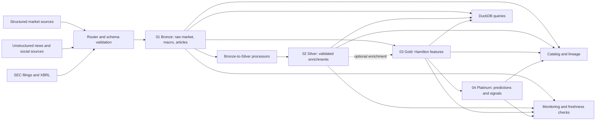

# Data Flow

Equity Lake uses four numbered medallion layers. Source identifiers are routed
by `ingestion/router.py`; destinations are mapped by `ingestion/types.py` and
written as date-partitioned Delta tables whose data files are Parquet.

Price sources are required prerequisites for feature generation. News, social,
macro, analyst, and SEC branches are optional enrichments: their failure is
recorded and the core feature path may continue without them. Bronze-to-Silver
processors are run only when their source branch is selected; their failure
disables that enrichment, not independent core features.
