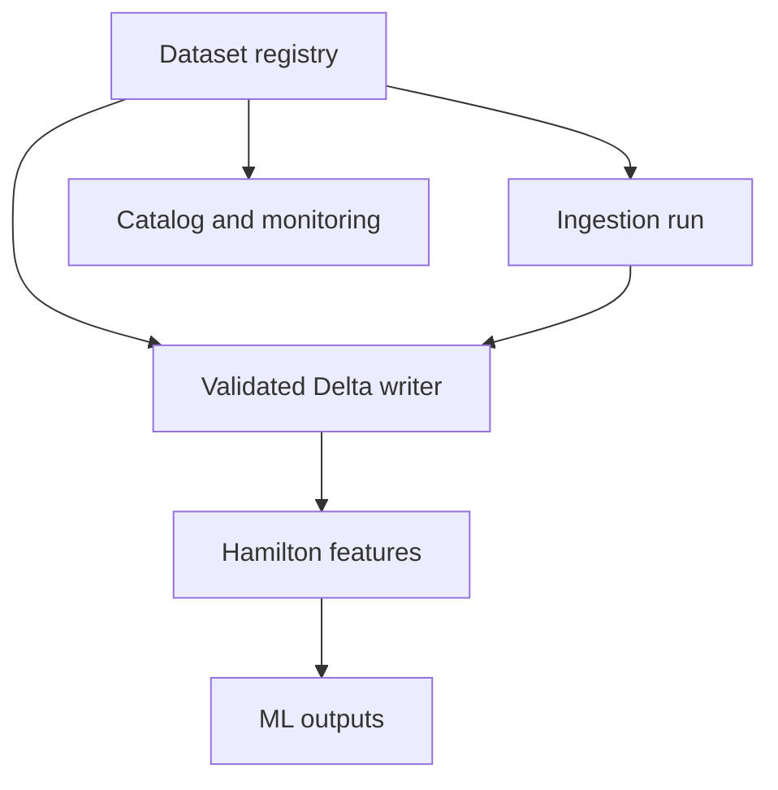

I reviewed the current `main` branch through commit [`c555a01`](https://github.com/minghao51/equity_lake/commit/c555a012fc4824a246ed86c5c7193a6533a301a6). The project’s core choices—local-first execution, Delta/Parquet, DuckDB, Hamilton, Polars, and one Typer CLI—remain sensible.

The main opportunity is consolidation: several competing sources of truth and orchestration paths are causing real correctness bugs, dead commands, and documentation drift.

## Highest-priority findings

| Priority | Finding                                                          | Impact                                                                                                                                               | Recommended change                                                                                                  |
| -------- | ---------------------------------------------------------------- | ---------------------------------------------------------------------------------------------------------------------------------------------------- | ------------------------------------------------------------------------------------------------------------------- |
| P0       | `equity ingest` without `--markets` passes an empty list.        | The documented default command completes successfully without ingesting anything.                                                                    | Resolve markets from `settings.ingestion.default_markets`. Add a CLI behavior test.                                 |
| P0       | Already-existing data disappears from ingestion results.         | An idempotent pipeline rerun sees missing results as required-source failures and blocks features/ML.                                                | Replace `dict[str, bool]` with `SourceOutcome(status=written/skipped/failed)`. Treat `skipped_existing` as success. |
| P0       | Feature and ML writes are not checked.                           | The pipeline can report success even when Delta persistence returns `False`.                                                                         | Make write failure fail the corresponding stage.                                                                    |
| P0       | S3 sync copies the same bucket path into every market directory. | A US-only prefix could be replicated into CN/HK/JPX/KRX directories.                                                                                 | Sync the root once, or explicitly map each remote prefix to one canonical destination.                              |
| P0       | Delta maintenance defaults use legacy flat names.                | `delta-vacuum`, `delta-compact`, and `delta-migrate` target `data/lake/us_equity`, while runtime data lives under `01_bronze/market_data/us_equity`. | Resolve all CLI dataset arguments through the canonical dataset registry.                                           |
| P1       | `merge_delta()` appends after a schema mismatch.                 | This bypasses merge-key deduplication and can create duplicate business keys.                                                                        | Explicitly align/evolve schema and retry the merge, or fail with a migration error. Never silently append.          |

Evidence: [CLI data commands](https://github.com/minghao51/equity_lake/blob/main/src/equity_lake/cli/commands/data.py), [ingestion orchestrator](https://github.com/minghao51/equity_lake/blob/main/src/equity_lake/ingestion/orchestrator.py), [pipeline executor](https://github.com/minghao51/equity_lake/blob/main/src/equity_lake/pipeline.py), [feature job](https://github.com/minghao51/equity_lake/blob/main/src/equity_lake/features/__init__.py), [ML job](https://github.com/minghao51/equity_lake/blob/main/src/equity_lake/ml/__init__.py), [Delta storage](https://github.com/minghao51/equity_lake/blob/main/src/equity_lake/storage/delta.py), [S3 sync](https://github.com/minghao51/equity_lake/blob/main/src/equity_lake/storage/s3_sync.py).

## Main architectural simplification

Create one canonical `DatasetSpec`/`SourceSpec` registry by consolidating existing registries—not by adding another framework.

Each entry should hold:

* source ID and dataset ID
* medallion path
* required or optional classification
* fetcher factory and supported capabilities
* schema contract
* merge keys
* freshness/skip policy
* catalog name and description

It would replace or generate:

* `MARKET_REGISTRY`
* `Market` literal and `VALID_MARKETS`
* `MARKET_DIR_MAP`
* `_REQUIRED_PRICE_MARKETS` and `_OPTIONAL_ENRICHMENT_MARKETS`
* writer schema/dedupe conditionals
* `updates.engine.SOURCES`
* dashboard and monitoring dataset lists
* most static catalog definitions

Currently this information is repeated across [router.py](https://github.com/minghao51/equity_lake/blob/main/src/equity_lake/ingestion/router.py), [types.py](https://github.com/minghao51/equity_lake/blob/main/src/equity_lake/ingestion/types.py), [writers.py](https://github.com/minghao51/equity_lake/blob/main/src/equity_lake/ingestion/writers.py), [paths.py](https://github.com/minghao51/equity_lake/blob/main/src/equity_lake/core/paths.py), [catalog/datasets.py](https://github.com/minghao51/equity_lake/blob/main/src/equity_lake/catalog/datasets.py), and [monitoring/health.py](https://github.com/minghao51/equity_lake/blob/main/src/equity_lake/monitoring/health.py).

A simplified target shape is:

## Duplicate and dead paths

These are strong removal or consolidation candidates:

* `updates/engine.py` has no in-repository runtime caller; only tests instantiate it. It duplicates ingestion routing, history, range fetching, and writing—and uses legacy flat storage paths. The README advertises `equity update`, but no such Typer command is registered. Fold useful smart-range logic into ingestion/backfill, then remove `updates/`.

* `us_sec_financials` is fetched, written, catalogued, and enabled by default, but has no downstream feature, signal, dashboard, or ML consumer. Either restore a point-in-time financial enrichment node or remove it from the default pipeline.

* The EOD pipeline ingests `us_news` and `us_social_sentiment`, but never enables their Hamilton feature joins. News still has a signal consumer; social sentiment is effectively disconnected from the standard pipeline.

* `validate_news_data_quality()` has no in-repository caller.

* `FeaturePipeline.compute_features()`, `export_lineage()`, caching, and the unused `inputs` argument have no application callers. Preserve only if they are intentionally supported library APIs.

* Legacy argparse entrypoints remain in backfill, monitoring, and dashboard exporter despite the unified Typer CLI being canonical.

* Dead CLI options:

  * `backtest --walk-forward` is accepted but unused.
  * `query --date` is accepted but unused.
  * `validate profile --save` is unused—and profiling currently writes regardless.

* Misleading compatibility names remain:

  * `write_to_partitioned_parquet()` actually performs a Delta merge.
  * `save_signals_to_parquet()` actually writes Delta.

  Rename the canonical APIs to `upsert_dataset()` and `save_signals()` and retain aliases only for a short deprecation period.

## Hamilton and feature architecture

Hamilton should remain, but the 570-line [`enrichments_04.py`](https://github.com/minghao51/equity_lake/blob/main/src/equity_lake/features/dag/enrichments_04.py) currently hides all enrichment work behind one `enriched_features` node with sequential boolean branches. Consequently, the catalog cannot show real enrichment lineage, and each enrichment cannot be independently selected or cached.

Split it into explicit nodes:

* load/aggregate news sentiment
* load/aggregate social sentiment
* load analyst ratings
* load SEC extractions
* load macro
* pure merge nodes for each source
* cross-modal features
* final enriched feature frame

This would make Hamilton materially useful for modularity, testing, caching, and reuse without changing the medallion structure.

## Configuration and monitoring drift

Several settings exist but do not control runtime behavior:

* `storage.*` is unused; paths come from `core.paths`.
* `ingestion.parallel` and `ingestion.max_workers` are ignored.
* `cn_fallback_threshold` is unused.
* monitoring CLI defaults ignore configured monitoring values.
* macro retry delay is stored but not propagated to individual fetchers.

Choose one policy for each field: wire it into runtime or delete it. Configurability that does nothing is worse than a documented fixed default.

Monitoring also covers only US, CN, and HK/SG freshness, omitting JPX and KRX even though they are classified as required price markets. It should iterate over the same registry used by ingestion.

## Catalog and documentation

The catalog is only partly generated:

* Dataset definitions, paths, types, and lineage are mostly static.
* Dataset lineage is inferred as “every dataset in the previous layer,” producing false relationships.
* The freshness workflow only runs for DAG/catalog changes, not schema, path, writer, or ingestion-contract changes.
* `risk_sentiment` is catalogued as a string while the SEC processor treats it numerically.

Generate dataset entries from the proposed registry and schema models, and derive lineage from actual read/write relationships rather than layer adjacency.

Documentation also has clear drift:

* [AGENTS.md](https://github.com/minghao51/equity_lake/blob/main/AGENTS.md) still lists the deleted `loaders/` package.
* [ARCHITECTURE.md](https://github.com/minghao51/equity_lake/blob/main/docs/developer/architecture/ARCHITECTURE.md) refers to deleted `storage/compaction.py`.
* `STRUCTURE.md` contains nonexistent imports and legacy paths.
* `ml-analytics-platform.md` imports the removed `equity_lake.pipelines` package.
* The README’s data-layout example omits numbered medallion directories.

Keep one concise canonical architecture document, the generated catalog, and short operational contract pages. Archive historical plans rather than allowing them to resemble current reference documentation.

## Recommended implementation order

1. **Operational correctness PR**

   Fix default ingest behavior, skipped-existing outcomes, write-result propagation, canonical Delta maintenance paths, and S3 prefix handling. Add regression tests for all five.

2. **Consolidation PR**

   Introduce the single registry, remove `updates/`, replace boolean ingestion results with structured outcomes, and make monitoring/dashboard/catalog consume the registry.

3. **Feature and dead-code PR**

   Split Hamilton enrichment nodes, decide the fate of SEC financials/social sentiment, remove unused CLI options and legacy argparse entrypoints, and rename misleading persistence APIs.

4. **Documentation/catalog PR**

   Generate catalog metadata from runtime contracts, expand freshness triggers, and remove stale architecture documentation.

The first PR should happen before further feature work: the current false-success and rerun behavior can make a green pipeline result unreliable even though the underlying components are generally well structured.
