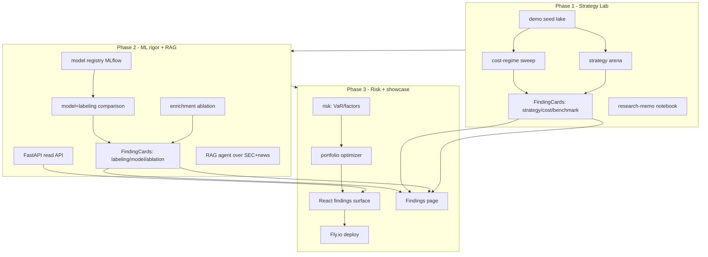

# Portfolio Showcase — Implementation Map

**Date:** 2026-08-04
**Companion to:** [`20260804-portfolio-roadmap.md`](./20260804-portfolio-roadmap.md)
**Recon:** [`20260804-integration-recon.md`](./20260804-integration-recon.md) supersedes any conflicting specifics below (CLI shapes, backend swap sites, RAG seam, deploy).
**Purpose:** File-level build plan for the full 3-month portfolio push, plus a
unifying artifact contract that ties every phase together. Per-phase handoffs
live in `20260804-portfolio-phase{1,2,3}-handoff.md`.

---

## 1. Grounding principles

1. **Reuse, don't reinvent.** The hard engines exist — `PriceForecaster`,
   `VectorBacktestEngine`, the Hamilton DAG, `lake_reader`, `llm_base`. New work
   is *adapters, harnesses, surfaces*, not new frameworks. (Honors AGENTS.md
   "Minimal Scope / No new abstractions".)
2. **Every phase emits the same artifact: a `FindingCard`.** Comparisons and
   findings are the portfolio lead (see roadmap §3). Each card is evidence-backed
   and machine-readable, so the final React surface renders them with no bespoke
   wiring per card.
3. **Read path is decoupled from compute.** Compute runs on a schedule and writes
   **snapshots** (parquet/json + FindingCards) to the lake; the API/frontend only
   reads snapshots. This keeps the hosted app stateless and cheap.
4. **Honor the change matrix.** New source → router/type/schema/tests/docs/catalog;
   CLI change → help/test/user-guide; schema change → validators/catalog/reader.
5. **W&B Reports are a free showcase surface.** Each phase publishes a public
   W&B Report (experiment comparison, findings) linkable from the README — zero
   extra hosting. Decisions D2/D3 locked: LightGBM included; tracking = W&B.

## 2. The unifying artifact: `FindingCard`

A small Pydantic model in a new `findings/` module. Every comparison the roadmap
promises produces one or more cards. The React "Findings" surface consumes them
verbatim.

```python
# src/equity_lake/findings/models.py  (new)
class FindingCard(BaseModel):
    id: str                       # e.g. "meta_label_vs_direction"
    axis: Literal["labeling","model","ablation","strategy","cost","benchmark"]
    claim: str                    # one-line hypothesis tested
    verdict: Literal["positive","negative","inconclusive"]
    conclusion: str               # honest one-liner, incl. negatives
    metrics: dict[str, float]     # sharpe, precision, oos_acc, ...
    evidence_refs: list[str]      # paths to parquet/png/json artifacts
    run_date: date
    scope: dict[str, Any]         # tickers, window, costs, seed
```

- Serialized to `data/findings/<id>.json` + evidence under `data/findings/<id>/`.
- Served read-only by `api/routers/findings.py` (Phase 3).
- **Negative results are first-class** — a defensible negative is the strongest
  portfolio line.

## 3. Dependency & ordering graph



Hard ordering: **P1 before P2 before P3.** Within P2, the FastAPI API and the
RAG agent are independent and can run in parallel. `FindingCard` is the single
contract every phase fulfills.

## 4. File-level inventory by workstream

Legend: ➕ new · ✏️ modify · 📦 new dependency. Paths are relative to repo root.

### Phase 1 — Substrate + Strategy Lab

| Path | | Purpose | Reuses |
|---|---|---|---|
| `src/equity_lake/findings/__init__.py` `models.py` `writer.py` | ➕ | `FindingCard` schema + writer (§2) | `pydantic`, `core/paths.py` |
| `src/equity_lake/devtools/seed_demo.py` | ➕ | Idempotent demo-universe bootstrap (50–100 US tickers, ~5y + FRED macro) | `sources/us.py`, `sources/macro.py`, `ingestion/orchestrator.py` |
| `src/equity_lake/cli/commands/admin.py` `cli/bootstrap.py` | ✏️ | `equity demo seed` command (calls `seed_demo`) | existing Typer app |
| `src/equity_lake/backtesting/arena.py` | ➕ | Run all strategies + meta-labeled ensemble across cost regimes → `BacktestResult`s + `FindingCard`s | `backtesting/engine.py`, `backtesting/strategy/*`, `signals/generators/meta_label.py` |
| `src/equity_lake/backtesting/report.py` | ➕ | Serialize `BacktestResult` → equity-curve/drawdown/metrics artifacts (parquet+json) for the API | `backtesting/result.py` |
| `src/equity_lake/cli/commands/analysis.py` | ✏️ | `equity backtest report` + `equity arena run` | `backtesting/arena.py` |
| `config/tickers.yaml` | ✏️ | Add `demo` universe profile | existing validator |
| `notebooks/11-strategy-lab.ipynb` | ➕ | Research-memo notebook (hypothesis→method→OOS→caveat) | `lake_reader` |
| `README.md` `docs/technical_roadmap.md` | ✏️ | Hero section + kill Click/v0.4.0 drift | — |
| `Makefile` | ✏️ | `make demo` one-command bootstrap | — |

**New deps:** none. Everything exists.

### Phase 2 — ML rigor + RAG agent

| Path | | Purpose | Reuses |
|---|---|---|---|
| `src/equity_lake/ml/registry.py` | ➕ | **W&B** tracking adapter; logs metrics/config/SHAP-as-artifact; JSON metadata `forecasting.py` already emits stays the local source of truth | `ml/trainer.py` (SHAP), `ml/forecasting.py` `_save_training_metadata`, `wandb` |
| `src/equity_lake/ml/backends.py` | ➕ | `ModelBackend` protocol + XGBoost + LightGBM impls behind a config flag | `ml/forecasting.py` (estimator swap only) |
| `src/equity_lake/ml/comparison.py` | ➕ | v1-direction vs v2-meta-label OOS harness + XGB vs LGBM table → FindingCards | `ml/validation.py` (`PurgedEmbargoedWalkForwardSplitter`), `findings/` |
| `src/equity_lake/ml/ablation.py` | ➕ | Enriched vs technical-only feature sweep (toggle DAG enrichment flags) → FindingCard | `features/dag/enrichments_04.py`, `features/__init__.py` `run_feature_job` |
| `src/equity_lake/api/__init__.py` `main.py` `routers/{signals,predictions,backtests,models,findings}.py` `deps.py` | ➕ | FastAPI read API over snapshots | `storage/lake_reader.py`, `storage/duckdb.py`, `findings/` |
| `src/equity_lake/dashboard/model_explorer.py` | ➕ | Streamlit page: calibration, SHAP beeswarm, drift vs last model | `dashboard/streamlit_app.py` pattern |
| `src/equity_lake/agent/__init__.py` `rag.py` `tools.py` `eval.py` | ➕ | Tool-using RAG agent (SEC + news + DuckDB tool), citation-grounded, 20-Q&A eval set | `ingestion/llm_base.py`, `sources/sec_*`, `sources/news.py`, `openai` |
| `src/equity_lake/agent/index.py` | ➕ | Embed + index silver articles/SEC extractions into vector store | `storage/lake_reader.py` |
| `pyproject.toml` | ✏️ | New groups: `api` (fastapi, uvicorn), `agent` (openai embeddings, vector store), `ml` += mlflow, lightgbm | — |
| `Dockerfile` | ✏️ | Add `api` stage (multi-stage already in place) | existing Dockerfile |

**New deps:** 📦 `fastapi`, `uvicorn[standard]`, `wandb`, `lightgbm`, a vector store (recommend `sqlite-vec` to match the local-first ethos), OpenAI embeddings (client already present). W&B hosted free tier = public project + Reports, no server to run. Add `WANDB_API_KEY` / `WANDB_ENTITY` / `WANDB_PROJECT` to `.env.example`.

### Phase 3 — Risk analytics + showcase

| Path | | Purpose | Reuses |
|---|---|---|---|
| `src/equity_lake/ml/risk.py` | ➕ | Parametric + historical VaR/CVaR, rolling beta, factor exposures | `storage/lake_reader.py`, FRED macro |
| `src/equity_lake/portfolio/optimizer.py` | ➕ | Mean-variance efficient frontier + rebalance signal | `cvxpy` (or `scipy.optimize`) |
| `src/equity_lake/signals/portfolio.py` | ➕ | Portfolio-rebalance signal generator | `signals/generators/base.py` |
| `web/` (new, outside Python tree) | ➕ | Next.js/React app: Strategy Lab, Model Explorer, **Findings**, Chat, Portfolio | consumes FastAPI |
| `src/equity_lake/api/routers/{risk,portfolio,chat}.py` | ✏️ | Endpoints for the new surfaces | Phase-2 API |
| `fly.toml` `Dockerfile.api` `.github/workflows/snapshot.yml` | ➕ | Always-on deploy + nightly snapshot refresh | mirrors `pages.yml` schedule shape |
| `docs/case-studies/*.md` | ➕ | Findings-driven write-ups | — |
| `README.md` | ✏️ | Screenshots, top-findings-up-front, live-demo link | — |

**New deps:** 📦 `cvxpy` (or scipy — already a sklearn transitive); React via `npm` in `web/`.

## 5. Integration points (explicit reuse map)

| New code | Calls into (existing, unchanged) |
|---|---|
| `backtesting/arena.py` | `VectorBacktestEngine.run()` / `.optimize()`, `strategy/{momentum,mean_reversion,trend_following}` |
| `ml/comparison.py` | `PriceForecaster.train_model(validate=True)`, `run_purged_walk_forward_validation` |
| `ml/ablation.py` | `run_feature_job(..., enrichments=False/True)` via DAG enrichment flags |
| `ml/registry.py` | reads `*.training_metadata.json` + `*.training_audit.parquet` already written by `forecasting.py` |
| `api/routers/*` | `lake_reader`, `duckdb` connections, snapshot paths |
| `agent/rag.py` | `llm_base` OpenAI client, `lake_reader` for retrieval, `sec_fulltext`/`news` silver tables |
| `findings/writer.py` | `core/paths.py` for `data/findings/` location |

No existing engine signature changes. Where a small extension is needed (e.g. a
strategy-arena entrypoint), it is additive.

## 6. Effort & schedule

| Phase | Weeks | Critical path |
|---|---|---|
| 1 | ~2 | seed → arena → report → FindingCards → memo |
| 2 | ~3–4 | (registry+comparison+ablation) ∥ (FastAPI) ∥ (RAG) |
| 3 | ~3–4 | risk → optimizer → React findings → deploy |
| **Total** | ~9–10 | leaves buffer in each month for polish/video/case studies |

Phase 2 has the most parallelism — three independent workstreams.

## 7. Guardrails (from AGENTS.md change matrix)

- **Adding LightGBM / model backends:** treat as a new model variant → add ML
  comparison test, update `config/signals.yaml` docs, note in catalog only if it
  changes Platinum schema (it does not).
- **New `api/` and `agent/` top-level modules:** add to `tests/unit/test_import_boundaries.py`
  assertions (they may read `core/`/`storage/` but must not depend on `cli/`).
- **New CLI commands (`demo seed`, `arena run`, `backtest report`):** help text +
  a CLI test (extend `tests/unit/test_cli_unified.py`) + user-guide line.
- **New core deps (`mlflow`,`fastapi`,`cvxpy`, vector store):** add as optional
  `dependency-groups`, never base, to keep `uv sync` fast for the fast test suite.
- **Schema additions (FindingCard, risk outputs):** validators + catalog entries
  only if persisted to the lake; snapshots under `data/findings/` are not catalog
  medallion tables.

## 8. Decisions (resolved 2026-08-04)

**Primary (roadmap):** D2 LightGBM included; D3 tracking = **W&B** (`wandb` in
the `ml` group; `WANDB_*` stay raw/unprefixed in `.env.example`); vector store
`sqlite-vec`; first slice = lake population (`make demo`).

**Recon-driven** (see [`20260804-integration-recon.md`](./20260804-integration-recon.md) §B):
- **B1** — report commands live under a new `report` sub-app
  (`equity report backtest`); `backtest` stays flat. All new sub-apps
  (`report`, `arena`, `ml`, `risk`, `demo`, `api`) declared in `cli/_app.py`,
  wired in `__main__.py`.
- **B2** — extend `LAYER_BOUNDARIES` to cover `findings`/`api`/`agent`/`portfolio`.
- **B4** — LightGBM swap covers **4** estimator sites (incl. hardcoded params in
  `ml/forecasting.py:backtest()` and `ml/validation.py`); `ml/backends.py` needs a
  `build_estimator(backend, params, scale_pos_weight)` factory + param-name
  normalization + filename-token generalization (`_xgboost_` → `{backend}`).
- **B5** — `ml/comparison.py` reuses `PurgedEmbargoedWalkForwardSplitter.split()`
  directly (the aggregate `run_purged_walk_forward_validation` is XGBoost-locked).
- **B6** — `ml/ablation.py` calls `FeatureEngineer.generate_features` directly
  with `include_macro=False` for the technical-only arm (`run_feature_job` does
  not expose `include_macro`).
- **B8** — RAG reuses a `build_chat_client()`/`build_embedding_client()` factory
  in `ingestion/llm_base.py`; does **not** subclass `BaseLLMBatchProcessor`.
- **B9** — API routers use thin getters atop `duckdb_scan_for`/`read_delta`
  (`api/deps.py`); backtest persistence is created by Phase 1 `report.py`.
- **B10** — `fastapi`/`uvicorn` are **core** deps (prod Docker stage runs
  `--no-dev`); new `fly.toml` + `.github/workflows/deploy-fly.yml` (separate from
  `pages.yml`; needs `FLY_API_TOKEN`); `snapshot.yml` reuses `schedule.cron`.
- **B11** — `portfolio/` is top-level; risk/portfolio outputs are **JSON reports**
  (+ FindingCard) — no Platinum table → no schema chain.
- **B7** — fix the `silver/`→`02_silver/` write-path bug as a pre-Phase-1 PR
  ([`20260804-pre-phase1-hygiene.md`](./20260804-pre-phase1-hygiene.md)).
