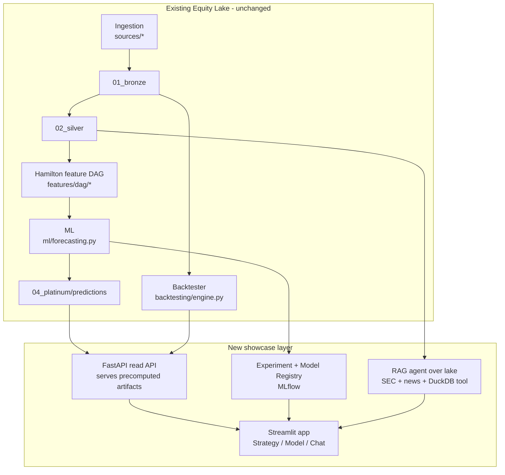

# Portfolio Showcase Roadmap (3 months)

**Date:** 2026-08-04
**Target role:** Data Scientist / Quant / AI Engineer
**Goal:** Turn Equity Lake from a strong local pipeline into a hosted, demoable
portfolio that leads with **validated alpha, ML rigor, and an AI agent**, with
the data platform as the supporting credential.

---

## 1. Thesis

The repo already implements the hard parts — multi-market ingestion, a Hamilton
feature DAG, quant-grade ML (triple-barrier labeling, meta-labeling, purged
walk-forward CV, SHAP), and a vectorized backtester. The gap is **visibility**:

- `data/` is empty (60K) → nothing to query, chart, or demo.
- The public surfaces (static dashboard + catalog graph) don't show signals,
  predictions, or P&L.
- No API or always-on app a reviewer can click.
- **No comparisons or findings are surfaced.** The repo can already contrast
  labeling schemes, models, strategies, and feature sets — but those
  comparisons are never run end-to-end and published. This is the real gap:
  a quant/AI reviewer wants "what did you find?", not "what did you build?"
- `docs/technical_roadmap.md` is stale (references Click + a "v0.4.0" that does
  not match `pyproject.toml` 0.1.0).

So the next three months **build the showcase layer on top of what exists**,
rather than adding more engines. The pipeline stays; the front door changes.

## 2. Stated decisions (override if you disagree)

| # | Decision | Default chosen | Rationale / alternative |
|---|----------|----------------|-------------------------|
| D1 | Hosting | **Paid small app** (Fly.io or Streamlit Cloud, ~$0–5/mo) + a read-only FastAPI | Reviewers get a live link. Confirmed. |
| D2 | ML model scope | **XGBoost primary + LightGBM comparison** (confirmed) | Same tabular domain, cheap, gives a real "I evaluated alternatives" comparison table. |
| D3 | Tracking tooling | **Weights & Biases (W&B)** — hosted free tier, public project + Reports reviewers can click | W&B Reports double as a findings showcase surface (zero extra hosting). `*.training_metadata.json` + SHAP audit parquet stay the local source of truth. |
| D4 | Frontend | **Phased:** Streamlit in Months 1–2 (fast iteration, stay in Python), **React/Next.js in Month 3** once the FastAPI read API + Strategy/Model/RAG artifacts exist | React earns its keep rendering rich interactive visuals (equity curves, SHAP beeswarm, strategy comparison, chat); building it before there is anything to show is premature. |
| D5 | Data source for demo | **yfinance ~5y history (US focus) + FRED macro**, ~50–100 tickers | Free, reliable, enough history for OOS backtests. CN/HK/JPX/KRX stay as "supported" but not the demo centerpiece. |

## 3. Showcase architecture (what gets added)

Everything below sits on top of existing modules. No rewrites.

**Hosting pattern (cheap, matches existing infra):** a scheduled GitHub Action
runs the nightly pipeline and pushes a **snapshot** of results (predictions,
backtest reports, feature snapshots) to object storage; the FastAPI + Streamlit
app reads the snapshot. This avoids running a live DB and reuses the existing
`pages.yml` schedule shape.

### Lead narrative — comparisons & findings

The portfolio's center of gravity is **"what I found,"** not "what I built."
Every comparison below becomes a card on a **Findings** surface with an honest
one-line conclusion — negatives included. Comparisons are accumulated across
all three months and published as one page in Month 3; each ships with the
evidence (equity curve, metrics table, calibration plot, SHAP) so a reviewer
verifies the conclusion rather than reading a bare claim.

| Comparison axis | Question answered | Built in |
|---|---|---|
| Labeling scheme | Does v2 meta-labeling beat v1 raw direction on precision / OOS P&L? (López de Prado) | Month 2 |
| Model family | XGBoost vs LightGBM — accuracy, calibration, feature-importance agreement | Month 2 |
| Feature ablation | Do enriched features (sentiment / SEC / analyst) beat technical-only? | Month 2 |
| Strategy | momentum vs mean-reversion vs trend-following vs meta-labeled ensemble — Sharpe / drawdown / turnover | Month 1 |
| Cost regime | How do Sharpe / returns degrade from zero-cost to realistic-cost? | Month 1 |
| Benchmark | Every strategy & model vs SPY buy-and-hold | Month 1 |

The strongest possible portfolio line is a defensible negative result: "I
built the enrichment pipeline, then ablated it and showed it did **not**
improve OOS prediction under realistic costs." Methodology honesty > cherry-
picked Sharpe.

## 4. Month-by-month milestones

### Month 1 — Substrate + Strategy Lab  *(quant credibility)*

**Theme:** make the lake real and produce the single artifact a quant will
scrutinize most — a defensible out-of-sample backtest.

| Deliverable | Built on | Exit criteria |
|---|---|---|
| Populate lake: 50–100 US tickers, ~5y, + FRED macro | `equity ingest`, `equity backfill` | DuckDB returns rows for every ticker; `equity monitor` green; `data/` > 50MB |
| Strategy Lab: honest OOS report for 3 strategies **+** meta-labeled ensemble | `backtesting/engine.py`, `signals/generators/meta_label.py` | Equity curve, drawdown, Sharpe/Sortino/Calmar, turnover, win-rate, slippage sensitivity, vs SPY buy-and-hold |
| Transaction-cost & leakage honesty pass | existing `VectorBacktestEngine` fee/tax config + purged CV already in `ml/validation.py` | Report states costs, embargo, and that meta-labels use ASOF/point-in-time joins (the C1 fix already done) |
| Research-memo notebook | `notebooks/` | One notebook reads like a memo: hypothesis → method → OOS results → caveat |
| README hero + kill roadmap drift | `README.md`, `docs/technical_roadmap.md` | Hero has 1-line pitch, architecture diagram, "Live demo" badge; `technical_roadmap.md` no longer mentions Click/v0.4.0 |

**Portfolio talking points earned:** "I built a leakage-free walk-forward
backtest with triple-barrier meta-labeling; here is the OOS Sharpe with real
costs."

### Month 2 — ML rigor + RAG agent  *(two credentials)*

**Theme:** prove ML engineering judgment and ship a modern AI feature.

| Deliverable | Built on | Exit criteria |
|---|---|---|
| Experiment + Model Registry (W&B) | existing `training_metadata.json`, `training_summary.json`, SHAP, `training_audit.parquet` in `ml/forecasting.py` | W&B runs per ticker; model cards; public W&B Report comparing v1-direction vs v2-meta-label OOS |
| Model explorer surface | new Streamlit page | Calibration plot, SHAP beeswarm, feature-skew warnings (already logged), drift detector vs last model |
| LightGBM comparison (D2) | new candidate in `ml/` | Side-by-side metrics with XGBoost; documented choice |
| **RAG agent over the lake** | `sources/sec_*`, `sources/news.py`, `ingestion/llm_*`, DuckDB | Natural-language Q&A ("Why bearish on X this week? What does the last 10-K risk section say?") with citations + a DuckDB tool for numeric facts |
| FastAPI read API | `storage/lake_reader.py`, `storage/duckdb.py` | Endpoints: signals, predictions, backtest equity curve, feature importances |

**Portfolio talking points earned:** "I instrumented every model with metadata,
SHAP, and audit artifacts; I compared two labeling schemes OOS; I built a
tool-using RAG agent grounded in SEC filings with citations."

### Month 3 — Risk analytics + showcase polish  *(depth + finish)*

**Theme:** round out the quant story and turn it into a finished product.

| Deliverable | Built on | Exit criteria |
|---|---|---|
| Risk analytics | new `ml/` or `signals/` risk module | Factor exposures, parametric + historical VaR/CVaR, rolling beta |
| Portfolio construction | pairs with `backtesting/` | Efficient frontier (mean-variance) + a portfolio-rebalance signal |
| Deploy always-on app (D1) | FastAPI read API + **React/Next.js** frontend → Fly.io | Public link on README; nightly snapshot refresh via GitHub Action; React consumes the stable FastAPI built in Month 2 |
| **Findings surface** | React app + FastAPI (built in Month 2) | One page publishing every comparison from the Lead Narrative as a card: claim → evidence → honest conclusion, negatives included |
| Demo video + case studies | — | 3-min walkthrough; findings-driven write-ups (e.g. "Does meta-labeling beat the base strategy OOS?" / "Does enrichment help?") |
| Portfolio README | `README.md` | Screenshots/GIF, **top findings stated up front**, links to live app + case studies |

**Portfolio talking points earned:** "End-to-end: I built the platform,
researched and validated the strategy, quantified the risk, shipped a live
product — and I can tell you, with evidence, **what worked and what didn't.**"

## 5. Out of scope (deliberate)

- **Streaming/intraday tier** — low signal for a DS/quant/AI role; high effort.
- **Plugin/entry-point loader architecture** from the old `technical_roadmap.md`
  — premature; the current source registry is sufficient for a portfolio.
- **Next.js/consumer frontend** — depth of analysis matters more than UI polish
  for this role.
- **CN/HK/JPX/KRX as demo centerpieces** — kept as "supported markets" breadth,
  US is the demo story.

## 6. Risks

| Risk | Mitigation |
|---|---|
| Backtest results look unimpressive (likely — markets are hard) | Lead with *methodology* honesty, not returns. A clean, leakage-free, cost-aware negative result is a stronger portfolio piece than a cherry-picked Sharpe. |
| MLflow adds infra overhead | Keep MLflow optional behind the `ml` extra; custom-registry (D3 alt) remains a fallback. |
| RAG hallucinates / cites wrongly | Force tool-grounded answers with citation spans; add an eval set of ~20 Q&A pairs; refuse-and-cite when no evidence. |
| Scope creep | Each month has explicit exit criteria; no month starts before the previous exits. |

## 7. Decisions log

1. **D2** — LightGBM comparison: **included.** (resolved 2026-08-04)
2. **D3** — Tracking: **Weights & Biases (W&B).** Hosted free tier; public
   project + Reports double as a findings showcase surface. (resolved 2026-08-04)
3. **D1 host** — Fly.io (more control, Docker you already have) for the
   FastAPI + React app; Streamlit for Month 1–2 iteration only.
4. **First code slice** — populate the lake first (`make demo`); unblocks every
   comparison and yields demoable raw queries within a day.
5. **Vector store** — recommend `sqlite-vec` (local-first); `chromadb` as fallback.
